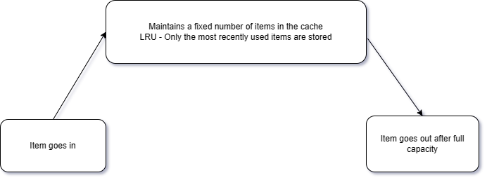
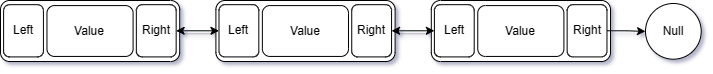
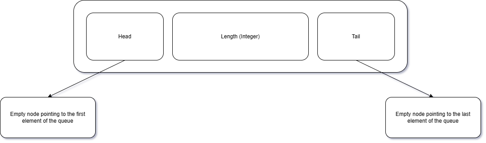
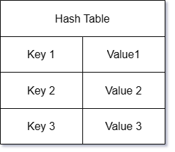

# LRU Cache

## Introduction

This is a simple implementation of a Least Recently Used Cache. It is a data structure that stores a fixed number of elements, and when the cache is full, the least recently used element is removed to make room for the new element.

For a true LRU cache:

1. If an item already exists in the cache, it is moved to the front of the cache.
2. The order of the items in the cache is from most recently used to least recently used.
3. Deletion happens from the back of the cache and insertion happens from the front of the cache.

## Data Structures Used

### Doubly Linked List

A doubly linked list is a data structure that consists of a series of nodes. Each node contains a value and a pointer to the next node in the list. The last node in the list points to null. Each node also contains a pointer to the previous node in the list. The first node in the list points to null.

### Queue

A queue is a data structure that stores a list of elements in a particular order. The order is First In First Out (FIFO). The queue has two main operations: enqueue and dequeue. Enqueue adds an element to the back of the queue. Dequeue removes an element from the front of the queue.

### Hash Table

A hash table is a data structure that stores key-value pairs. It uses a hash function to compute an index into an array of buckets or slots, from which the desired value can be found.
